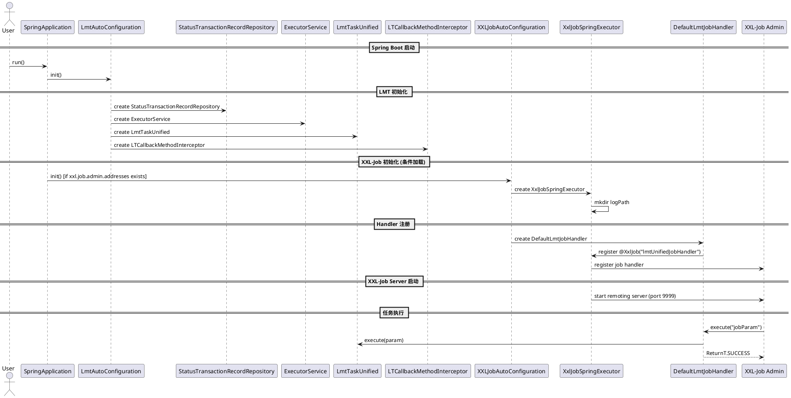

# 自动装配说明

## 1. 装配入口
com.charserzh.lmt.configuration.LmtAutoConfiguration

## 2. 自动装配文件(spring.factories)
> lmt-configuration/src/main/resources/META-INF/spring.factories

org.springframework.boot.autoconfigure.EnableAutoConfiguration=\
com.charserzh.lmt.configuration.LmtAutoConfiguration,\
com.charserzh.lmt.configuration.XXLJobAutoConfiguration,\
com.charserzh.lmt.configuration.LmtExecutorConfig

## 3. 自动装配类
LmtAutoConfiguration自动装配初始化顺序
```mermaid
                        ┌───────────────────────────────┐
                        │        Application             │
                        │  @SpringBootApplication        │
                        └─────────────┬─────────────────┘
                                      │
                                      ▼
                       ┌───────────────────────────────┐
                       │      LmtAutoConfiguration      │
                       └─────────────┬─────────────────┘
                                     │
       ┌─────────────────────────────┼─────────────────────────────┐
       ▼                             ▼                             ▼
┌─────────────────┐        ┌───────────────────────────┐  ┌───────────────────────────────┐
│ StatusTransaction│        │    LmtTaskUnified         │  │ LTCallbackMethodInterceptor  │
│ Repository Bean  │        │(depends on Repository +   │  │ (depends on Repository)      │
│                 │        │ ExecutorService)          │  │                               │
└─────────────────┘        └───────────────────────────┘  └───────────────────────────────┘
                                     │
                                     ▼
                       ┌───────────────────────────────┐
                       │   XXLJobAutoConfiguration     │
                       │  @ConditionalOnProperty       │
                       └─────────────┬─────────────────┘
                                     │
               ┌─────────────────────┼─────────────────────┐
               ▼                     ▼                     ▼
  ┌─────────────────────┐  ┌─────────────────────────┐    ┌───────────────────────┐
  │ XxlJobSpringExecutor │  │ DefaultLmtJobHandler    │    │  Log Directory Created │
  │(depends on properties│  │(depends on LmtTaskUnified│   │  if not exist)         │
  │ adminAddresses, etc.)│  │                         │    │                       │
  └─────────────────────┘  └─────────────────────────┘    └───────────────────────┘
               │                     │
               ▼                     ▼
   XXL-Job Admin / Executor          Handler Registered
     注册成功 / 启动成功             lmtUnifiedJobHandler

```

### 说明
1. XXLJobAutoConfiguration 先加载，保证 XxlJobSpringExecutor 可用。
2. LmtExecutorConfig 创建默认线程池（除非接入方自定义 Bean）。
3. LmtAutoConfiguration 注入核心 Bean：
   *  StatusTransactionRecordRepository
   *  LmtTaskUnified（注入线程池）
   *  LTCallbackMethodInterceptor

4. LmtTaskUnified 执行任务：
   * 并行模式使用注入线程池
   * 同步模式直接逐条执行回调

## 接入方使用线程池属性 vs 自定义 Bean 的决策流程图
```mermaid
                        ┌───────────────────────────────┐
                        │        Application             │
                        │  @SpringBootApplication        │
                        └─────────────┬─────────────────┘
                                      │
                                      ▼
                       ┌───────────────────────────────┐
                       │      LmtAutoConfiguration      │
                       └─────────────┬─────────────────┘
                                     │
       ┌─────────────────────────────┼─────────────────────────────┐
       ▼                             ▼                             ▼
┌─────────────────┐        ┌───────────────────────────┐  ┌───────────────────────────────┐
│ StatusTransaction│        │    LmtTaskUnified         │  │ LTCallbackMethodInterceptor  │
│ Repository Bean  │        │(depends on Repository +   │  │ (depends on Repository)      │
│                 │        │ ExecutorService)          │  │                               │
└─────────────────┘        └───────────────────────────┘  └───────────────────────────────┘
                                     │
                                     ▼
                       ┌───────────────────────────────┐
                       │   XXLJobAutoConfiguration     │
                       │  @ConditionalOnProperty       │
                       └─────────────┬─────────────────┘
                                     │
               ┌─────────────────────┼─────────────────────┐
               ▼                     ▼                     ▼
  ┌─────────────────────┐  ┌─────────────────────────┐    ┌───────────────────────┐
  │ XxlJobSpringExecutor │  │ DefaultLmtJobHandler    │    │  Log Directory Created │
  │(depends on properties│  │(depends on LmtTaskUnified│   │  if not exist)         │
  │ adminAddresses, etc.)│  │                         │    │                       │
  └─────────────────────┘  └─────────────────────────┘    └───────────────────────┘
               │                     │
               ▼                     ▼
   XXL-Job Admin / Executor          Handler Registered
     注册成功 / 启动成功             lmtUnifiedJobHandler

```

## 注册UML图




